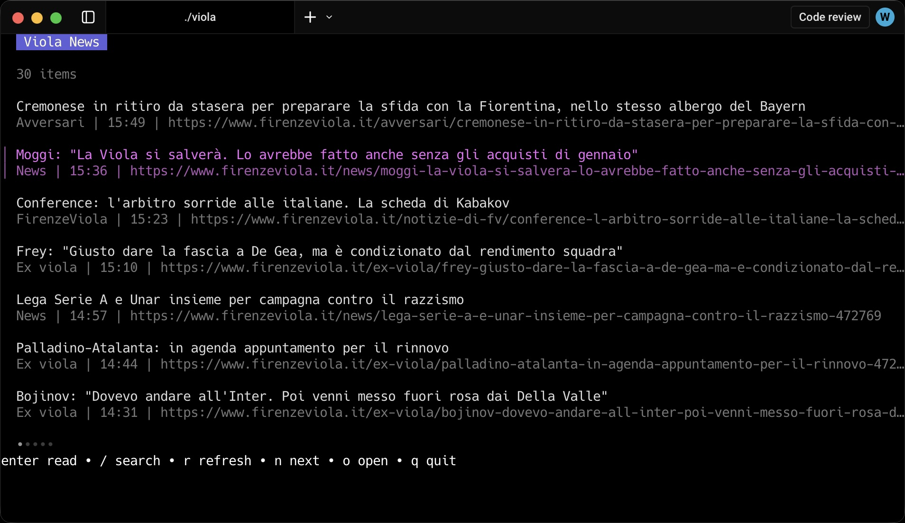

# viola-cli

`viola-cli` is a small Go CLI for reading FirenzeViola news.



## Install the CLI

```bash
brew tap n3d1117/viola-cli https://github.com/n3d1117/viola-cli
brew install n3d1117/viola-cli/viola
```

## Current scope

Today the CLI supports news only.

Commands:

```bash
viola news
viola news --plain --limit 10
viola news --search rakow
viola news --json
viola news --read firenzeviola.it-472733
```

Default behavior:

- In a normal terminal, `viola news` opens an interactive reader.
- If output is piped or redirected, it falls back to plain text.

## Features

- Fetch latest news
- Search news with the backend `q` parameter
- Read full article text from the detail API
- Render article HTML as readable markdown/plain text
- Open article links in the browser from the TUI
- Print list or detail output as JSON

## Build

```bash
go build ./cmd/viola
```

## Test

```bash
go test ./...
```

## Notes

- The backend is private and may change without notice.
- Private backend values are intentionally not stored in git. Set `VIOLA_PRIVATE_API_*` in your shell before running the CLI. `.env.example` shows a shell-ready example you can source.
- Social embed scraping is intentionally out of scope for v1.
